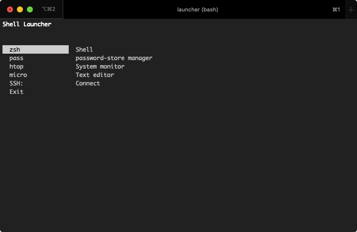

# bash-launcher

Command line utility to create command/app launchers.



## Table of contents

- [bash-launcher](#bash-launcher)
  - [Installation](#installation)
    - [jq](#jq)
    - [`install.sh`](#installsh)
      - [Arguments](#arguments)
  - [Usage](#usage)
    - [Launcher](#launcher)
    - [Configuration files](#configuration-files)
    - [Helpers](#helpers)

## Installation

### jq

jq is required as configuration files are in JSON files.

Debian/Ubuntu

```bash
# Dependencies
sudo apt-get install jq
```

macOS

```bash
brew install jq
```

### `install.sh`

An install script is provided for convenience. This script will create `.config/launcher/` under the current user home directory where configuration files will be stored. It will also install `launcher.sh`, `helpers/pass.sh` and `helpers/system.sh` into `/usr/local/bin`. The default launcher will be available by running `bash-launcher` on the command line.

Install by running:

```bash
sudo ./install.sh
```

#### Arguments

Some arguments are provided for configuring the install script:

```
--no-pass/-np        Don't install password-store helper
--no-settings/-ns    Don't install system settings helper
--help/-h            Show this help.
```

## Usage

### Launcher

If you installed the launcher by using the install script, run the launcher by executing:

```bash
launcher
```

You can also provide a config path via the `--config=PATH` argument. By default, `$HOME/.config/launcher/config.json` is used. Feel free to edit it to your liking.

### Configuration files

Configuration files are JSON files.

They are structured as follows:

```json
{
    "title": "Shell Launcher",
    "subtitle": "",
    "items": [{}, {}]
}
```

The title will be shown in bold when the program is started, next to the subtitle below the next line. To avoid errors, keep the subtitle short.

Items is an array of objects that represents each entry in the launcher. It contains the following properties:

- `name`: Name of the entry
- `description`: Description of the entry
- `type`': Type of execution. Accepts the values `command`, `submenu` or `exit`
- `run`: Command or file to be executed. If `type` is `command` the value will be executed as a command, if it is `submenu`, the launcher will be executed with the value of run as a configuration file and if it is `exit` the launcher execution is finished.
- `color` (Optional): Background color when selecting the
- `wait` (Optional): Tells the launcher if it should display a "Press any button to continue..." message. Useful in commands that only show information.

Separators can also be displayed. Simply, add an object in the following way and the launcher will take it as a separator:

```json
{
    "name": "",
    "description": " "
}
```

Feel free to experiment and modify. An example can be seen in `config/config.json`.

### Helpers

Two helpers are also provided:

- `pass-helper`: Script that allows managing password-store (OTP, List, Show, Insert) interactively from the terminal.
- `system-helper`: Allows configuring some settings such as increasing/decreasing brightness and shutting down/rebooting the system

Feel free to modify them to your needs, or add more.
