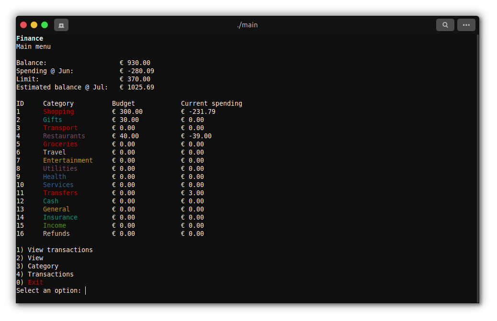
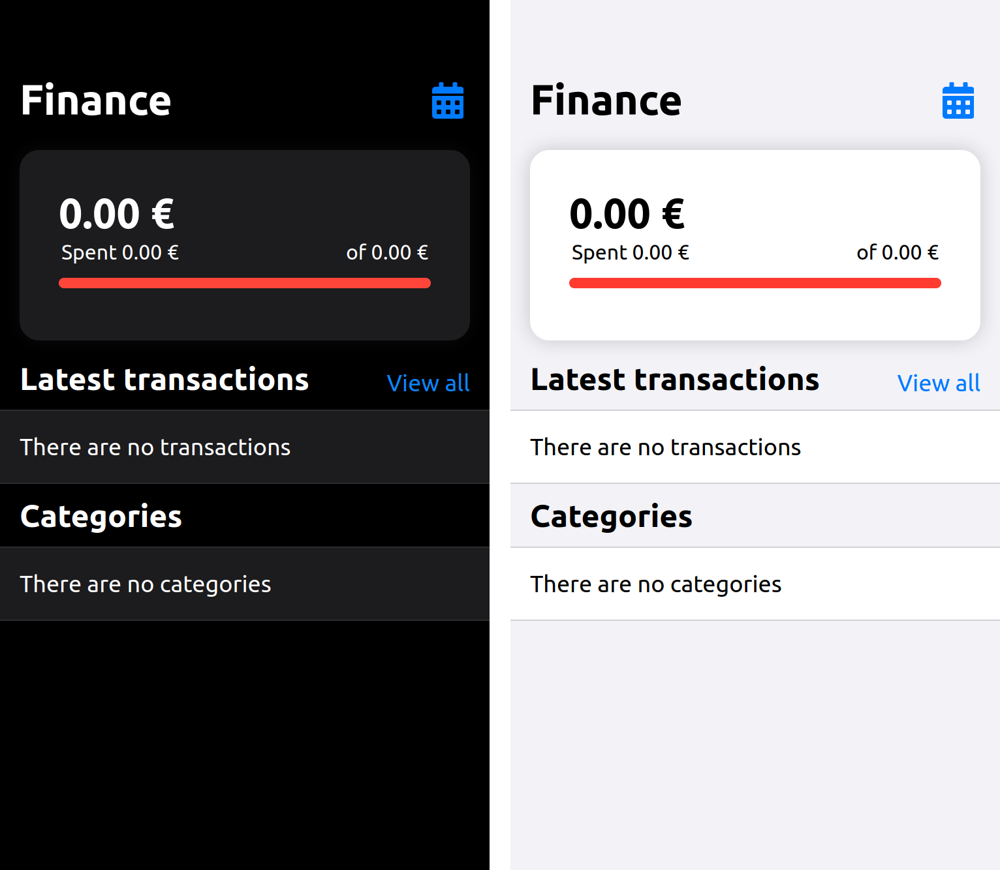

# finance

A simple, easy to use, finance manager.

## Table of contents

- [finance](#bash-launcher)
  - [About](#about)
  - [Features](#features)
  - [Installation](#installation)
    - [Dependencies](#dependencies)
    - [C Version](#c-version)
    - [Webapp](#webapp)
  - [Usage](#usage)

## About

finance is an attempt to create a simple, cross-platform and cross-language finance manager along with a finance storage schema. It is currently implemented as a C program and as a iOS 13-*like* webapp, along with a comma separated storage schema.

## Features

This program has the following features:

- [X] Total balance
- [X] View, add and remove categories with limits
- [X] View, add and delete transactions
- [X] Current month's expenditure, divided by categories with the possibility of changing the month to be shown
- [X] Balance forecast to a specific month
- [X] Webapp

While the following ones are in development:

- [ ] Code documentation
- [ ] Display a bar that graphically shows the percentage of category spending
- [ ] Configuration files

## Installation

### Dependencies

At the time, gcc and make are required in order to compile the C version.

Debian/Ubuntu

```bash
sudo apt-get install gcc make
```

macOS

```bash
brew install gcc make
```

If you want to use the web version, make sure to install `apache2-utils` for basic authentication.

Debian/Ubuntu

```bash
sudo apt-get install apache2-utils
```

### C version

1. Go to `C` folder
2. Compile using `make`
3. Use with `./main`

### Webapp

This webapp requires a webserver in order to successfully run. Currently there is no access protection so, basic authentication is recomended.

The following applies to the Nginx webserver:

1. Copy the `web` folder into `/var/www/html/` on your web server
2. Rename from `web` to `finance`
3. Add the `categories.txt` file and the `transactions.txt` file to the `finance` folder
    - Or symlink them if they already exist.
4. Add the following location into an nginx configuration file:
    ```nginx
    location ^~ /finance {
        auth_basic "Please, login to continue";
        auth_basic_user_file /etc/nginx/sites-enabled/.htpasswd;
        alias /var/www/html/finance;
    }
    ```
5. Execute the following command to generate a new password: `htpasswd -c /etc/nginx/sites-enabled/.htpasswd <username>`. You will be asked for a password.
    - To add more users, execute `htpasswd /etc/nginx/sites-enabled/.htpasswd <username>`
6. Restart nginx

## Usage

### Files

Data is currently split in 2 different, comma separated, files: `transactions.txt` and `categories.txt`. When using the program, this files are automattically formated in order to be legible outside the program.

#### Categories

Categories are stored in `categories.txt`. This file contains the category definitions. It follows this line structure: 

```
<category>, <limit>
```

Where:
- `category`: Name of the category
- `limit`: Limit of the category

#### Transactions

Transactions are stored in `transactions.txt`. This file contains all the transactions you want to take into account. It follows this line structure:

```
<date>, <name>, <category>, <value>
```

Where:
- `date`: ISO 8601 date representation. Example: year-month-day, 2020-01-02
- `name`: Name of the transactions. **Be careful** with commas in the name, as they will be treated as other field.
- `category`: Category name defined in `categories.txt`.
- `value`: Value of the transaction, positive for income, negative for spending.

### C Version

Once compiled, run the program with `./main`. Navigate the menus using numbers and the Enter key.



### Webapp

Navigate to `<domain.tld>/finance`, replacing `<domain.tld>` with your domain. Everything will be loaded.

You can expand the transaction list by clicking `View all`. The view date can be changed by clicking on the calendar icon on the upper right side of the app.


